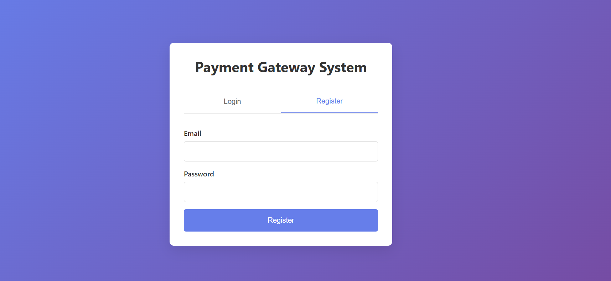
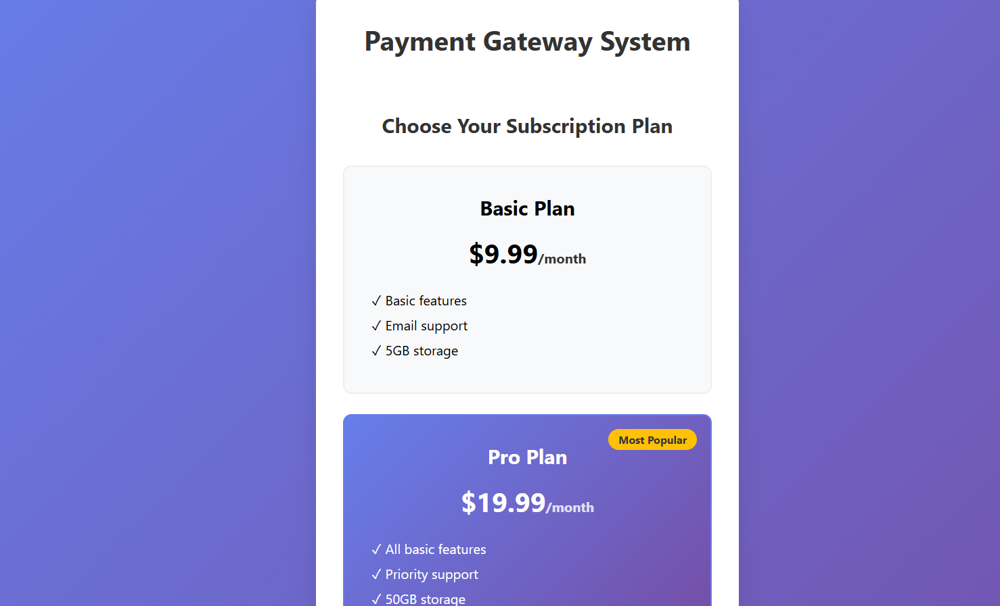

# Payment Gateway System

A comprehensive payment gateway system built with Node.js, Express.js, MongoDB, and Stripe integration. This system provides secure payment processing, user authentication, subscription management, and fraud detection capabilities.

*User registration interface*



*Subscription management interface*



*Payment processing interface*


## 🚀 Features

- **Secure Payment Processing**: Integration with Stripe for handling payments
- **User Authentication**: JWT-based authentication system
- **Subscription Management**: Recurring payment subscriptions
- **Fraud Detection**: Built-in middleware for fraud prevention
- **Rate Limiting**: Protection against API abuse
- **CORS Support**: Cross-origin resource sharing configuration
- **Database Integration**: MongoDB with Mongoose ODM
- **Security**: Helmet.js for security headers and bcrypt for password hashing

## 🛠️ Technology Stack

### Backend
- **Node.js** - Runtime environment
- **Express.js** - Web application framework
- **MongoDB** - NoSQL database
- **Mongoose** - MongoDB object modeling
- **Stripe** - Payment processing
- **JWT** - JSON Web Tokens for authentication
- **bcryptjs** - Password hashing
- **Helmet** - Security middleware
- **CORS** - Cross-origin resource sharing
- **Express Rate Limit** - Rate limiting middleware

### Frontend
- **HTML5** - Markup language
- **CSS3** - Styling with modern features
- **JavaScript** - Client-side scripting
- **Stripe.js** - Stripe's JavaScript library

## 📁 Project Structure

```
payment-gateway/
├── assets/                     # Project screenshots and images
│   ├── paymentpage.png
│   ├── registerpage.png
│   └── subscriptionpage.png
├── backend/                    # Backend application
│   ├── controllers/           # Business logic controllers
│   │   ├── paymentController.js
│   │   ├── subscriptionController.js
│   │   └── userController.js
│   ├── middlewares/           # Custom middleware
│   │   ├── auth.js
│   │   └── fraudDetection.js
│   ├── models/               # Database models
│   │   ├── Payment.js
│   │   ├── Subscription.js
│   │   └── User.js
│   ├── routes/               # API routes
│   │   ├── paymentRoutes.js
│   │   ├── subscriptionRoutes.js
│   │   └── userRoutes.js
│   ├── scripts/              # Utility scripts
│   │   └── cleanupDatabase.js
│   ├── package.json
│   └── server.js             # Main server file
└── frontend/                 # Frontend application
    └── index.html            # Main HTML file
```

## 🔗 API Routes

### User Authentication Routes (`/api/users`)

| Method | Endpoint | Description | Authentication |
|--------|----------|-------------|----------------|
| POST | `/api/users/register` | Register a new user | No |
| POST | `/api/users/login` | User login | No |

**Register Request:**
```json
{
  "email": "user@example.com",
  "password": "securepassword"
}
```

**Login Request:**
```json
{
  "email": "user@example.com",
  "password": "securepassword"
}
```

### Payment Routes (`/api/payments`)

| Method | Endpoint | Description | Authentication | Middleware |
|--------|----------|-------------|----------------|------------|
| POST | `/api/payments/create-payment-intent` | Create a payment intent | Required | Fraud Detection |
| POST | `/api/payments/confirm-payment` | Confirm payment | Required | - |
| GET | `/api/payments/history` | Get payment history | Required | - |

**Create Payment Intent Request:**
```json
{
  "amount": 29.99,
  "currency": "usd",
  "description": "Product purchase"
}
```

**Confirm Payment Request:**
```json
{
  "paymentIntentId": "pi_1234567890",
  "paymentMethodId": "pm_1234567890"
}
```

### Subscription Routes (`/api/subscriptions`)

| Method | Endpoint | Description | Authentication |
|--------|----------|-------------|----------------|
| POST | `/api/subscriptions/create` | Create a new subscription | Required |
| GET | `/api/subscriptions/` | Get user subscriptions | Required |

**Create Subscription Request:**
```json
{
  "priceId": "price_1234567890"
}
```

## 🔒 Security Features

### Authentication Middleware
- **JWT Verification**: Validates JSON Web Tokens for protected routes
- **User Context**: Adds user information to request object

### Fraud Detection Middleware
- **Suspicious Pattern Detection**: Monitors for unusual payment patterns
- **IP-based Filtering**: Tracks and limits suspicious IP addresses
- **Transaction Monitoring**: Analyzes transaction frequency and amounts

### Rate Limiting
- **API Protection**: Limits requests to 100 per 15-minute window per IP
- **DDoS Prevention**: Protects against denial-of-service attacks

### Security Headers
- **Helmet.js**: Sets various HTTP headers for security
- **CORS Configuration**: Controlled cross-origin resource sharing

## 💾 Database Models

### User Model
```javascript
{
  email: String (required, unique),
  password: String (required, hashed),
  stripeCustomerId: String,
  createdAt: Date (default: Date.now)
}
```

### Payment Model
```javascript
{
  userId: ObjectId (ref: User),
  stripePaymentIntentId: String,
  amount: Number,
  currency: String,
  description: String,
  status: String (pending, succeeded, failed),
  createdAt: Date (default: Date.now)
}
```

### Subscription Model
```javascript
{
  userId: ObjectId (ref: User),
  stripeSubscriptionId: String,
  status: String,
  priceId: String,
  createdAt: Date (default: Date.now)
}
```

## 🚀 Installation and Setup

### Prerequisites
- Node.js (v14 or higher)
- MongoDB
- Stripe account

### Environment Variables
Create a `.env` file in the backend directory:

```env
PORT=3000
MONGODB_URI=mongodb://localhost:27017/payment_gateway
STRIPE_SECRET_KEY=sk_test_your_stripe_secret_key
STRIPE_PUBLISHABLE_KEY=pk_test_your_stripe_publishable_key
JWT_SECRET=your_jwt_secret_key
FRONTEND_URL=http://localhost:5500
```

### Installation Steps

1. **Clone the repository:**
   ```bash
   git clone https://github.com/rajibsalui/Payment-Gateway.git
   cd Payment-Gateway
   ```

2. **Install backend dependencies:**
   ```bash
   cd backend
   npm install
   ```

3. **Start MongoDB:**
   ```bash
   mongod
   ```

4. **Start the backend server:**
   ```bash
   # Development mode
   npm run dev

   # Production mode
   npm start
   ```

5. **Serve the frontend:**
   Open `frontend/index.html` in a browser or use a local server:
   ```bash
   # Using Python
   python -m http.server 5500

   # Using Node.js http-server
   npx http-server frontend -p 5500
   ```

## 🧪 Testing

The application includes built-in validation and error handling:

- **Input Validation**: Joi schema validation for API requests
- **Authentication Testing**: JWT token validation
- **Payment Testing**: Stripe test mode integration
- **Error Handling**: Comprehensive error responses

## 📝 Usage Examples

### Frontend Integration

The frontend provides a complete user interface with:

1. **User Registration/Login Forms**
2. **Payment Processing Interface**
3. **Subscription Management**
4. **Payment History Display**

### API Integration Examples

**Register a new user:**
```javascript
fetch('/api/users/register', {
  method: 'POST',
  headers: { 'Content-Type': 'application/json' },
  body: JSON.stringify({
    email: 'user@example.com',
    password: 'securepassword'
  })
});
```

**Create a payment:**
```javascript
fetch('/api/payments/create-payment-intent', {
  method: 'POST',
  headers: {
    'Content-Type': 'application/json',
    'Authorization': `Bearer ${token}`
  },
  body: JSON.stringify({
    amount: 29.99,
    currency: 'usd',
    description: 'Product purchase'
  })
});
```

## 🔧 Maintenance

### Database Cleanup
Run the cleanup script to remove old records:
```bash
node backend/scripts/cleanupDatabase.js
```

### Monitoring
- Monitor payment success rates
- Track failed transactions
- Review fraud detection logs
- Monitor API rate limits

## 🤝 Contributing

1. Fork the repository
2. Create a feature branch (`git checkout -b feature/AmazingFeature`)
3. Commit your changes (`git commit -m 'Add some AmazingFeature'`)
4. Push to the branch (`git push origin feature/AmazingFeature`)
5. Open a Pull Request

## 📄 License

This project is licensed under the MIT License - see the LICENSE file for details.

## 📞 Support

For support, email rajibsalui@example.com or create an issue in this repository.

## 🙏 Acknowledgments

- Stripe for payment processing infrastructure
- MongoDB for database solutions
- Express.js community for excellent documentation
- All contributors and testers

---

**Note**: This is a demonstration project. For production use, ensure additional security measures, comprehensive testing, and compliance with payment processing regulations.
